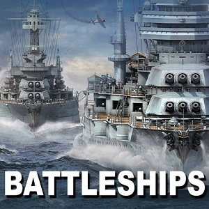

# Python Battleship Game 

[](https://travis-ci.org/zachpuck/python-battleship)



----

A single player game of battleship written in python

----

## Install with [helm](https://helm.sh/)

```shell
helm install ./battleship-deployment
```

the game will be exposed on a NodePort
